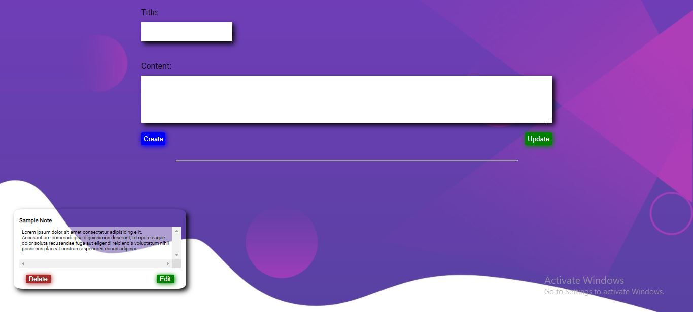

# basic CRUD app using SpringBoot and Fetch API # 
a simple application for creating,deleting and editing notes

**Preview:** 

## Backend ## 
backend developped using spring web to create the rest api endpoints, and spring data to persiste data 
in a mysql database. 

### endpoints created: ### 
  **GET** /api/notes  
  **POST** /api/notes  
  **PUT** /api/notes/{id}  
  **DELETE** /api/notes/{id}  

  ## Frontend ## 
  used vanilla css and javascript and the fetch api to fetch data from the server.  

